# 交接文档

## 目录

- [`gitflow` 工作流](#gitflow工作流)
    - [流程图](#流程图)
    - [相关钩子文件](#相关钩子文件)
        - [检测`php`代码规范](#检测php代码规范)
        - [`semantic`约定式提交规范检测](#semantic约定式提交规范检测)
- [`drone` 基本配置与使用](#drone基本配置与使用)
    - [`drone` 部署信息](#drone部署信息)
    - [`drone` 配置](#drone配置)
        - [`go`项目](#go项目)
        - [`php`项目](#php项目)
    - [drone插件说明](#drone插件说明)
    - [密钥管理 `vault`](#密钥管理vault)
    - [华为云 `swr`](#华为云swr)
    - [常用`dockerfile`](#常用dockerfile)
- [`jenkins` 信息](#jenkins信息)
- [`k8s` 基本配置与使用](#k8s基本配置与使用)
    - [`k8s` 简介](#k8s简介)
    - [常用 `service` 模版](#常用service模版)
    - [常用 `deployment` 模版](#常用deployment模版)

## gitflow工作流

### 流程图



### 相关钩子文件

项目中使用了 `pre-receive` 钩子用于检测代码规范, `git commit` 提交规范

#### 检测php代码规范

- psr2
关于 psr2 规范,详见: [psr2 官方文档](https://www.php-fig.org/psr/psr-2/)

psr2 规范检测,使用的是 [phpcs](https://pear.php.net/package/PHP_CodeSniffer) 代码检测工具,pre-receive 钩子文件如下:

```bash
#!/bin/sh
echo "
                      __  
  ___  ____ _      __/ /__
 / _ \/ __ \ | /| / / //_/
/  __/ /_/ / |/ |/ / ,<   
\___/ .___/|__/|__/_/|_|  
   /_/                    
"
PHPCS_CODING_STANDARD="PSR2"

TMP_DIR=$(mktemp -d phpcs-pre-receive-hook.XXXXXXXX)

mkdir "$TMP_DIR/source"

RETVAL=0

echo '检测 PHP PRS2 编码规范...'
while read oldrev newrev refname
do
    if [[ "$oldrev" = "0000000000000000000000000000000000000000" ]]
    then
        oldrev="HEAD"
    fi

    if [[ "$newrev" = "0000000000000000000000000000000000000000" ]]
    then
        newrev=$oldrev
    fi

    list=$(git diff-tree --name-only -r $oldrev..$newrev | grep -e '.php$')
    for file in ${list}; do
        mkdir -p $(dirname "$TMP_DIR/source/$file")
        git show ${newrev}:${file} 1>"$TMP_DIR/source/$file" 2>/dev/null  || continue  #skip deleted files
        OUTPUT=$(phpcs  --standard=$PHPCS_CODING_STANDARD "$TMP_DIR/source/$file")
        if [[ "$?" -ne "0" ]]; then
            echo "${OUTPUT}"
            RETVAL=1
        fi
    done

done

if [[ $RETVAL = 0 ]];then
  echo 'PRS2 校验成功'
else
  echo 'PRS2 校验失败，请修改错误并重新提交'
  rm -rf $TMP_DIR
  exit 1
fi
```


#### semantic约定式提交规范检测

关于约定式提交规范,之前已有整理相关文档: [git commit 消息格式规范](http://git.epweike.net/epwk/workflow/src/branch/master/git/how-to-commit.md)

定式提交规范检测,使用的是 [commitlint](https://commitlint.js.org/#/) 检测工具, 钩子文件如下:

```bash
#!/bin/sh
echo "
                      __  
  ___  ____ _      __/ /__
 / _ \/ __ \ | /| / / //_/
/  __/ /_/ / |/ |/ / ,<   
\___/ .___/|__/|__/_/|_|  
   /_/                    
"

TMP_DIR=$(mktemp -d commitlint-pre-receive-hook.XXXXXXXX)
config_file='.commitlintrc.yml'

mkdir "$TMP_DIR/source"

COMMIT_RETVAL=0

echo '检测 `git commit` 约定式提交规范...'
while read oldrev newrev refname
do
    if [[ "$oldrev" = "0000000000000000000000000000000000000000" ]]
    then
        oldrev="HEAD"
    fi

    if [[ "$newrev" = "0000000000000000000000000000000000000000" ]]
    then
        newrev=$oldrev
    fi

    git show master:$config_file 1>"$TMP_DIR/source/$config_file" 2>/dev/null
    COMMIT_OUTPUT=$(commitlint -g "$TMP_DIR/source/$config_file" -f $oldrev -t $newrev)
    if [[ "$?" -ne "0" && ! -z ${COMMIT_OUTPUT} ]]; then
        echo $COMMIT_OUTPUT
        COMMIT_RETVAL=1
    fi

done

rm -rf $TMP_DIR

if [[ $COMMIT_RETVAL = 0 ]];then
    echo '`git commit` 规范校验成功'
else
    echo '`git commit` 规范校验失败，请修改错误并重新提交'
    exit 1
fi

```

## drone基本配置与使用

详细介绍见官网文档(目前只有英文): https://docs.drone.io/

### drone部署信息

drone 使用分布式部署,分为 Server 与 Runner (可以理解为 master 与 node),这里都采用 docker 部署,docker-compose 编排

- Server 部署信息

配置|信息
---|---
服务器|10.0.100.160
docker-compose.yaml路径|/data/drone/docker-compose.yaml

常用命令

```bash
# 查看应用状态
sudo docker-compose ps

# 关闭
sudo docker-compose down

# 启动
sudo docker-compose up -d

# 查看日志
sudo docker-compose logs -f

# 进入容器
sudo docker-compose exec drone sh
```

- Runner 部署信息

项目部署了2个 runner 节点

配置|信息
---|---
服务器1|10.0.100.160
docker-compose.yaml路径|/data/drone/docker-compose-agent.yml
服务器2|10.0.100.54
docker-compose.yaml路径|/data/drone/docker-compose.yaml

常用命令,不同服务器注意更改 -f 后跟随的配置文件名

```bash
# 查看应用状态
sudo docker-compose -f docker-compose-agent.yml ps

# 关闭
sudo docker-compose -f docker-compose-agent.yml down

# 启动
sudo docker-compose -f docker-compose-agent.yml up -d

# 查看日志
sudo docker-compose -f docker-compose-agent.yml logs -f

# 进入容器
sudo docker-compose exec agent sh
```

### drone配置

这里列举项目中常用的 drone 配置

#### go项目

```yaml
kind: pipeline
name: build

platform:
  os: linux
  arch: amd64

steps:
# 创建数据卷
- name: create_volumes
  image: 10.0.100.114/drone/create-config:v1.0.0
  commands:
    - mkdir -p /cache/${DRONE_REPO}/docker-lib1
    - mkdir -p /cache/${DRONE_REPO}/gocache
  volumes:
    - name: cache
      path: /cache

# 创建配置文件
- name: create_env
  image: 10.0.100.114/drone/create-config:v1.0.0
  settings:
    test_content:
      from_secret: test_app_env
    product_content:
      from_secret: app_env
    file_name: app.ini
    file_path: configs
  depends_on:
  - create_volumes

# 构建
- name: go_build
  image: 10.0.100.114/library/golang:1.13.5-alpine
  volumes:
  # 缓存 gocache
  - name: gocache
    path: /go
  commands:
  - CGO_ENABLED=0 GOOS=linux go build -ldflags="-w -s" -a -installsuffix cgo -o cmd/eisgn/esign cmd/esign/main.go
  when:
    branch:
      exclude:
        - master
  depends_on:
  - create_volumes

# 语义化发布，仅在合并至 master 分支时执行
- name: semantic_release
  image: 10.0.100.114/drone/semantic-release:v1.0.4
  pull: always
  environment:
    GIT_CREDENTIALS:
      from_secret: git_credentials
    GIT_AUTHOR_NAME:
      from_secret: git_release_name
    GIT_AUTHOR_EMAIL:
      from_secret: git_release_email
    GIT_COMMITTER_NAME:
      from_secret: git_release_name
    GIT_COMMITTER_EMAIL:
      from_secret: git_release_email
  settings:
    gitea_token:
      from_secret: gitea_token
  when:
    branch:
    - master
    event:
    - push
  depends_on:
  - create_volumes

# 构建镜像并推送至仓库
- name: docker_build
  image: plugins/docker
  settings:
    username:
      from_secret: docker_username
    password:
      from_secret: docker_password
    repo: 10.0.100.114/test/${DRONE_REPO_NAME}/${DRONE_COMMIT_BRANCH//\//-}
    registry: 10.0.100.114
    tag: ${DRONE_BUILD_NUMBER}
    insecure: true
    use_cache: true
    dockerfile: build/Dockerfile
    build_args:
      - DOCKER_REGISTRY=10.0.100.114
  volumes:
  - name: docker-lib1
    path: /var/lib/docker
  when:
    event:
    - push
    branch:
      include:
      - develop
      - feat/*
      - fix/*
      - weekly/*
  depends_on:
  - go_build

# 构建生产环境镜像并推送至仓库
- name: docker_build_product
  image: plugins/docker
  settings:
    username:
      from_secret: product_docker_username
    password:
      from_secret: product_docker_password
    repo: registry.epweike.com/product/${DRONE_REPO_NAME}
    registry: registry.epweike.com
    insecure: true
    use_cache: true
    dockerfile: build/Dockerfile
    tag: ${DRONE_TAG}
    build_args:
      - DOCKER_REGISTRY=registry.epweike.com
  volumes:
  - name: docker-lib1
    path: /var/lib/docker
  when:
    event:
    - tag
  depends_on:
  - go_build

# 部署 web 应用
- name: deployment_web
  image: 10.0.100.114/drone/k8s-client:v1.12
  pull: always
  settings:
    deployment: ${DRONE_COMMIT_BRANCH//\//-}-esign-epweike-net
    service: ${DRONE_COMMIT_BRANCH//\//-}-esign-epweike-net
    port: 8000
    namespace: default
    container1: ${DRONE_COMMIT_BRANCH//\//-}-esign-epweike-net
    ingress_name: ${DRONE_COMMIT_BRANCH//\//-}-esign-epweike-net
    host: ${DRONE_COMMIT_BRANCH//\//-}.esign.epweike.net
    image1: 10.0.100.114/test/${DRONE_REPO_NAME}/${DRONE_COMMIT_BRANCH//\//-}:${DRONE_BUILD_NUMBER}
    label: ${DRONE_COMMIT_BRANCH//\//-}-esign-epweike-net
    type: 1
    branch: ${DRONE_COMMIT_BRANCH//\//-}
    domain_type: 2
  when:
    event:
    - push
    branch:
      include:
      - develop
      - feat/*
      - fix/*
      - weekly/*
  depends_on:
  - docker_build

volumes:
- name: cache
  host:
    path: /var/cache
- name: docker-lib1
  host:
    path: /var/cache/${DRONE_REPO}/docker-lib1
- name: gocache
  host:
    path: /var/cache/${DRONE_REPO}/gocache

trigger:
  event:
  - push
  - tag
  branch:
    include:
    - master
    - develop
    - feat/*
    - fix/*
    - weekly/*
    - 

---
kind: secret
name: docker_username
get:
  path: test/docker
  name: username

---
kind: secret
name: docker_password
get:
  path: test/docker
  name: password

---
kind: secret
name: product_docker_username
get:
  path: product/docker
  name: username

---
kind: secret
name: product_docker_password
get:
  path: product/docker
  name: password

---
kind: secret
name: git_credentials
get:
  path: common/git
  name: release_credential

---
kind: secret
name: git_release_name
get:
  path: common/git
  name: release_name

---
kind: secret
name: git_release_email
get:
  path: common/git
  name: release_email

---
kind: secret
name: test_app_env
get:
  path: test/esign.epweike.net
  name: env

---
kind: secret
name: app_env
get:
  path: product/esign.epweike.net
  name: env

---
kind: secret
name: gitea_token
get:
  path: common/gitea
  name: token

---
kind: secret
name: dingtalk_token
get:
  path: common/dingtalk
  name: token
```

#### php项目

```yaml
kind: pipeline
name: build

platform:
  os: linux
  arch: amd64

steps:
# 创建数据卷
- name: create_volumes
  image: 10.0.100.114/drone/create-env:1.1.2
  commands:
    - mkdir -p /cache/${DRONE_REPO}/docker-lib1
    - mkdir -p /cache/${DRONE_REPO}/docker-lib2
  volumes:
    - name: cache
      path: /cache

# 创建配置文件
- name: create_env
  image: 10.0.100.114/drone/create-config:v1.0.0
  settings:
    test_content:
      from_secret: test_app_env
    product_content:
      from_secret: app_env
    file_name: app.php
    file_path: data/config
  depends_on:
  - create_volumes

# 语义化发布，仅在合并至 master 分支时执行
- name: semantic_release
  image: 10.0.100.114/drone/semantic-release:v1.0.4
  pull: always
  environment:
    GIT_CREDENTIALS:
      from_secret: git_credentials
    GIT_AUTHOR_NAME:
      from_secret: git_release_name
    GIT_AUTHOR_EMAIL:
      from_secret: git_release_email
    GIT_COMMITTER_NAME:
      from_secret: git_release_name
    GIT_COMMITTER_EMAIL:
      from_secret: git_release_email
  settings:
    gitea_token:
      from_secret: gitea_token
  when:
    branch:
    - master
    event:
    - push
  depends_on:
  - create_volumes

# 构建镜像并推送至仓库
- name: build_php
  image: plugins/docker
  settings:
    username:
      from_secret: docker_username
    password:
      from_secret: docker_password
    repo: 10.0.100.114/test/${DRONE_REPO_NAME}/fpm
    registry: 10.0.100.114
    tag: ${DRONE_BUILD_NUMBER}
    insecure: true
    use_cache: true
    dockerfile: build/Dockerfile.fpm
    build_args:
      - DOCKER_REGISTRY=10.0.100.114
  volumes:
  - name: docker-lib1
    path: /var/lib/docker
  when:
    event:
    - push
    branch:
      include:
      - develop
  depends_on:
  - create_env

# 构建镜像并推送至仓库
- name: build_nginx
  image: plugins/docker
  settings:
    username:
      from_secret: docker_username
    password:
      from_secret: docker_password
    repo: 10.0.100.114/test/${DRONE_REPO_NAME}/nginx
    registry: 10.0.100.114
    tag: ${DRONE_BUILD_NUMBER}
    insecure: true
    use_cache: true
    dockerfile: build/Dockerfile.nginx
    build_args:
      - DOCKER_REGISTRY=10.0.100.114
  volumes:
  - name: docker-lib2
    path: /var/lib/docker
  when:
    event:
    - push
    branch:
      include:
      - develop
  depends_on:
  - create_env

# 构建生产环境镜像并推送至仓库
- name: docker_build_php_product
  image: plugins/docker
  settings:
    username:
      from_secret: product_docker_username
    password:
      from_secret: product_docker_password
    repo: swr.cn-east-2.myhuaweicloud.com/epwk/${DRONE_REPO_NAME}-fpm
    registry: swr.cn-east-2.myhuaweicloud.com
    use_cache: true
    dockerfile: build/Dockerfile.fpm
    build_args:
      - DOCKER_REGISTRY=swr.cn-east-2.myhuaweicloud.com
    tag: ${DRONE_TAG}
  volumes:
  - name: docker-lib1
    path: /var/lib/docker
  when:
    event:
    - tag
  depends_on:
  - create_env

# 构建生产环境镜像并推送至仓库
- name: docker_build_nginx_product
  image: plugins/docker
  settings:
    username:
      from_secret: product_docker_username
    password:
      from_secret: product_docker_password
    repo: swr.cn-east-2.myhuaweicloud.com/epwk/${DRONE_REPO_NAME}
    registry: swr.cn-east-2.myhuaweicloud.com
    use_cache: true
    dockerfile: build/Dockerfile.nginx
    build_args:
      - DOCKER_REGISTRY=swr.cn-east-2.myhuaweicloud.com
    tag: ${DRONE_TAG}
  volumes:
  - name: docker-lib2
    path: /var/lib/docker
  when:
    event:
    - tag
  depends_on:
  - create_env

# 部署 web 应用
- name: deployment_web
  image: 10.0.100.114/drone/k8s-client:v1.13
  pull: always
  settings:
    deployment: www-gmaward-net
    service: www-gmaward-net
    port: 80
    namespace: default
    container1: nginx
    image1: 10.0.100.114/test/${DRONE_REPO_NAME}/nginx:${DRONE_BUILD_NUMBER}
    container2: fpm
    image2: 10.0.100.114/test/${DRONE_REPO_NAME}/fpm:${DRONE_BUILD_NUMBER}
    label: www-gmaward-net
    type: 2
    branch: ${DRONE_COMMIT_BRANCH}
  when:
    event:
    - push
    branch:
      include:
      - develop
  depends_on:
  - build_php
  - build_nginx

volumes:
- name: cache
  host:
    path: /var/cache
- name: docker-lib1
  host:
    path: /var/cache/${DRONE_REPO}/docker-lib1
- name: docker-lib2
  host:
    path: /var/cache/${DRONE_REPO}/docker-lib2

trigger:
  event:
  - push
  - tag
  branch:
    include:
    - master
    - develop
    - 

---
kind: secret
name: docker_username
get:
  path: test/docker
  name: username

---
kind: secret
name: docker_password
get:
  path: test/docker
  name: password

---
kind: secret
name: product_docker_username
get:
  path: product/docker
  name: swrusername

---
kind: secret
name: product_docker_password
get:
  path: product/docker
  name: swrpassword

---
kind: secret
name: git_credentials
get:
  path: common/git
  name: release_credential

---
kind: secret
name: git_release_name
get:
  path: common/git
  name: release_name

---
kind: secret
name: git_release_email
get:
  path: common/git
  name: release_email

---
kind: secret
name: gitea_token
get:
  path: common/gitea
  name: token

---
kind: secret
name: dingtalk_token
get:
  path: common/dingtalk
  name: token

---
kind: secret
name: test_app_env
get:
  path: test/www.gmaward.net
  name: app

---
kind: secret
name: app_env
get:
  path: product/www.gmaward.net
  name: app

```

### drone插件说明

drone 官网有[插件市场](http://plugins.drone.io/),项目中也用到了许多官方插件市场的插件,官网插件不再赘述,这里列举几个针对一品项目自定义的插件:

- create-config

用于创建测试环境与生产环境的配置文件,搭配 vault 使用,详细使用见代码仓库的 readme

项目地址: http://git.epweike.net/epwk/drone-config-plugin

- semantic-release

语义化发布插件,根据规范的 git commit 提交历史,生成语义化版本号,并将 change log 自动发布至代码仓库,详细使用见代码仓库的 readme

项目地址:http://git.epweike.net/epwk/drone-semantic-release

### 密钥管理vault

#### 简介

valut 是第三方密钥管理平台,文档地址:https://www.vaultproject.io/docs/secrets/

- 访问地址:

```
http://10.0.100.160:8200/
```

- 登录:

valut 支持多种登录方式,管理员账号以 token 方式登录,值为:

```
s.27tVELwh9O5tWlQwtZIyET4R
```

#### 解锁

vault 首次启动或重启后,需要先解锁 token,依次输入以下 token,用于解锁(至少3个)

```
Key 1: 3Fo51kNmuVo76tKBktrhOTaq6Jh0ySuMIJ/SZvPBshjx
Key 2: lEX+qjQW3Tu9riSCDYfilo8r6gV0XYx3ARAmMGdSopL4
Key 3: IZi/ChDUQgpmBFxfr0f+EADgw3nlO+RB5AWWdPVvl32y
Key 4: U0UQGdCmhJAgTTm25CNLUxJ1fE8y9gpdICO3wwS1DTbC
Key 5: +NUoY1iAxW3OE0P7z+k8z+Bz3EhMf/V4/6J/+0TLiEoI
```

### 华为云swr

- [获取长期有效docker login指令](https://support.huaweicloud.com/usermanual-swr/swr_01_1000.html)

- 获取登录密钥

```
printf "IPPKKR51ZJLDLJFIFTNH" | openssl dgst -binary -sha256 -hmac "ACfP7nkuGn6a9pa3rXkc4uZt040Sj5EF8MT0KAsZ" | od -An -vtx1 | sed 's/[ \n]//g' | sed 'N;s/\n//'
abcc4794a611494ef9636462fbf83c0b48e915544c0f03a739c252ab24bd432a
```
- docker login 指令

```
docker login -u cn-east-2@IPPKKR51ZJLDLJFIFTNH -p abcc4794a611494ef9636462fbf83c0b48e915544c0f03a739c252ab24bd432a swr.cn-east-2.myhuaweicloud.com
```

### 常用dockerfile

见项目:http://git.epweike.net/epwk/dockerfile

## jenkins信息

华为云 jenkins 登录地址

```
http://122.112.140.166:8000/
```

用户名密码

```
epwk
wnhiz1offorwppmg
```

## k8s基本配置与使用

### k8s简介

详见:[官网文档](https://kubernetes.io/zh/docs/home/)

### 常用service模版

官网文档详见: https://kubernetes.io/zh/docs/concepts/services-networking/service/

以下只列举几个通过 Kubernetes 集群外部 IP 地址暴露 Service 的常用模版

- ClusterIP

需搭配 ingress 实现对外暴露

service 模版:

```yaml
apiVersion: v1
kind: Service
metadata:
  # 本服务的名称,需保证唯一
  name: develop-svc-web-vip
  # 所属命名空间
  namespace: default
  labels:
    # 本服务被其他组件选择时指定的名称,一般与 name 保持一致即可
    app: develop-svc-web-vip
spec:
  ports:
  # 端口号
  - port: 8000
    protocol: TCP
  selector:
    # 对应的 deployment 名称,填写对应 deployment 的 labels 字段
    app: develop-ep-micro-web-vip

```

- NodePort

```yaml
apiVersion: v1
kind: Service
metadata:
  # 本服务的名称,需保证唯一
  name: gmaward-com-service
spec:
  type: NodePort
  ports:
  # 对集群内部暴露的端口号
  - port: 3010
    # 目标 deployment 的端口号
    targetPort: 80
    # 对外暴露的端口号,需保证唯一
    nodePort: 30010
  selector:
      # 对应的 deployment 名称,填写对应 deployment 的 labels 字段
      app: gmaward-com
```

### 常用deployment模版

deployment 配置相对比较统一

```yaml
apiVersion: apps/v1
kind: Deployment
metadata:
  # 名称,需保证唯一
  name: gmaward-com
  labels:
  # 本deployment被其他组件选择时指定的名称,一般与 name 保持一致即可
    app: gmaward-com
spec:
  replicas: 1
  selector:
    matchLabels:
      # 与 name 保持一致即可
      app: gmaward-com
  template:
    metadata:
      labels:
        # 与 name 保持一致即可
        app: gmaward-com
    spec:
      # 容器声明
      containers:
       # 名称
      - name: nginx
        # 镜像名
        image: swr.cn-east-2.myhuaweicloud.com/www.gmaward.net/nginx:v1.1.3
        imagePullPolicy: Always
        ports:
        # 暴露的端口
        - containerPort: 80
      # 容器2 名称,如果只有一个容器可不声明
      - name: fpm
        image: swr.cn-east-2.myhuaweicloud.com/www.gmaward.net/fpm:v1.1.3
        imagePullPolicy: Always
      # 拉去镜像时使用的密钥,当镜像存储在私有仓库时必填
      imagePullSecrets:
      - name: regsecret

```

