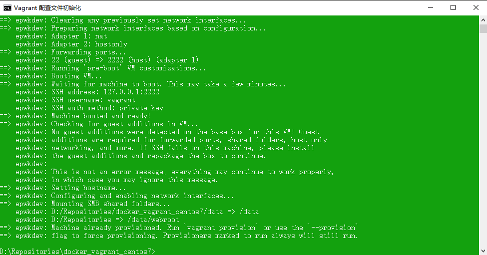
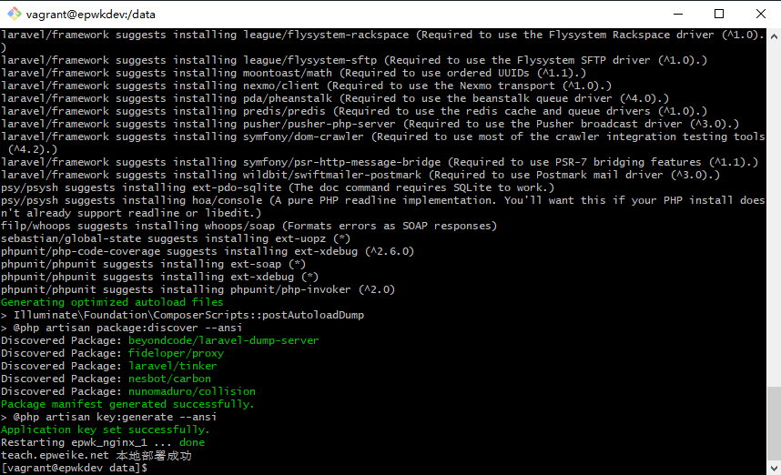
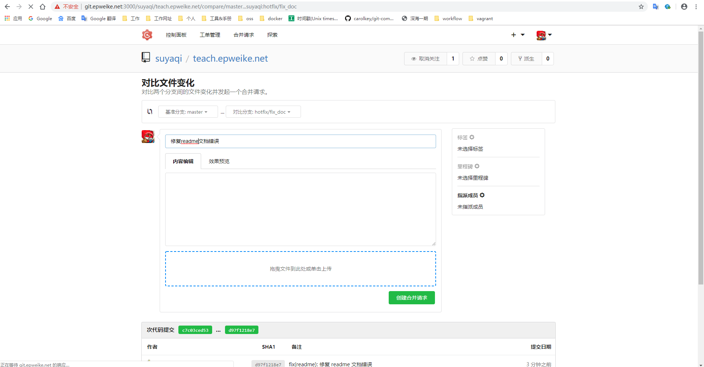

# 项目新人上手教程

- [关于「能愿动词」的使用](#关于「能愿动词」的使用)
- [配置本地开发环境](#配置本地开发环境)
- [Docker 基本教程](#Docker-基本教程)
    - [Docker 常用命令](#Docker-常用命令)
- [Git 基本教程](#Git-基本教程)
    - [Git 常用命令](#Git-常用命令)
    - [Git 提交规范](#Git-提交规范)
- [Gitflow 工作流](#Gitflow-工作流)
- [代码书写规范](#代码书写规范)
- [开发实践](#开发实践)
    - [配置开发环境](#配置开发环境)
    - [获取项目代码](#获取项目代码)
    - [运行项目](#运行项目)
    - [功能开发](#功能开发)
        - [提交功能开发代码](#提交功能开发代码)
        - [发起功能分支代码合并请求](#发起功能分支代码合并请求)
        - [合并功能分支](#合并功能分支)
    - [BUG 修复](#BUG-修复)
        - [提交 BUG 修复代码](#提交-BUG-修复代码)
        - [发起 BUG 分支代码合并请求](#发起-BUG-分支代码合并请求)
        - [合并 BUG 分支](#合并-BUG-分支)
- [代码不规范或者提交不规范如何重新提交](#代码不规范或者提交不规范如何重新提交)
    - [代码不规范](#代码不规范)
    - [commit 不规范](#Commit-提交不规范)
- [提问的艺术](#提问的艺术)

## 关于「能愿动词」的使用

为了避免歧义，文档大量使用了「能愿动词」，对应的解释如下：

- `必须 (MUST)`：绝对，严格遵循，请照做，无条件遵守
- `一定不可 (MUST NOT)`：禁令，严令禁止
- `应该 (SHOULD)` ：强烈建议这样做，但是不强求
- `不该 (SHOULD NOT)`：强烈不建议这样做，但是不强求
- `可以 (MAY)` 和 `可选 (OPTIONAL)` ：选择性高一点，在这个文档内，此词语使用较少

## 配置本地开发环境

`必须` 使用 **[「docker_vagrant_centos7」](http://git.epweike.net:3000/epwk/docker_vagrant_centos7)** 作为本地开发环境。

- 为什么使用 Vagrant
    > 使用 Vagrant 管理的虚拟机具有良好的可移植性，并且可以简单的使用配置文件 `Vagrantfile` 来配置虚拟机，缩短本地开发环境的搭建时间
- 什么是 Docker
	> 参见 [什么是 Docker](https://yeasy.gitbooks.io/docker_practice/introduction/what.html)
- 为什么使用统一的开发环境
	> 避免出现「Work on my machine」。在开发过程中，可能由于环境的不一致导致在你的电脑上运行的程序没有问题，但是到了别人的电脑就出现了各种各样的毛病，为了避免这种问题，应该使用统一的开发环境

## Docker 基本教程

- 这里有一份很详细的 [Docker — 从入门到实践](https://yeasy.gitbooks.io/docker_practice/)
- 本地的开发环境，`必须` 使用 [「docker-compose」](https://docs.docker.com/compose/overview/) 编排容器

### Docker 常用命令

```
// 拉取镜像
docker pull

// 列出本地镜像
docker image ls

// 删除本地镜像
docker image rm

// 创建并运行容器
docker run

// 查看容器
docker ps

// 停止容器
docker stop

// 启动容器
docker start

// 删除容器
docker rm

// 容器交互
docker exec
```

## Git 基本教程

- [GIT 简明指南](http://rogerdudler.github.io/git-guide/index.zh.html)
- [GIT 廖雪峰教程](https://www.liaoxuefeng.com/wiki/896043488029600)
- [GIT 官方文档](https://git-scm.com/book/zh/v2)

### Git 常用命令

```
// 配置
git config

// 克隆仓库
git clone

// 切换分支
git checkout

// 分支管理
git branch

// 拉取更新
git fetch
git pull

// 合并分支
git merge

// 查看状态
git status

// 提交代码
git commit

// 推送到远程分支
git push

// 查看日志
git log

// 撤销更改
git revert
git reset
```

### Git 提交规范

严格规范 `git commit` 消息填写格式，有助于提高项目历史信息的可读性。并且，`git commit` 消息将作为项目版本发布的 change log，在 ci 流程中使用「语义化发布工具」自动生成。

所以我们规定 Git 提交代码 `必须` 遵循 **[「how-to-commit」](../git/how-to-commit.md)**。

## Gitflow 工作流

- 什么是 [Gitflow工作流](https://nvie.com/posts/a-successful-git-branching-model/)
- 适合我们团队的 [「Gitflow」](../README.md)

## 代码书写规范

在编程写代码期间，常常会遇到类似这样的情况：

- 别人：之前写的代码，自己接手该项目，发现之前代码写的很烂，开始骂之前的人太挫，水平太垃圾
- 自己：之前一段时间，比如2个月、1年，写的代码，自己后来需要接着开发或维护，结果发现之前自己写的代码的逻辑都有点记不清楚了

为了避免这种情况，所以我们才要写出好的代码，有良好的代码习惯和风格。

良好的代码规范可以：
- 降低决策成本
- 降低阅读成本
- 降低维护成本
- 有助于程序员自身的成长

我们以[「优帆远扬」](https://learnku.com/docs/laravel-specification/5.5)团队的代码规范为基础，整理出适合我们团队的 [「代码规范」](http://git.epweike.net:3000/epwk/laravel_code_specification)，所有的开发人员都 `必须` 遵循此规范。

## 开发实践

在上手一些基本技能之后，我们用一个 DEMO 来上手项目开发。

### 配置开发环境

`VirtualBox` 和 `Vagrant` 软件的安装和基本使用这里就不再赘述。

首先检出开发环境的项目并启动 `Vagrant`：

```
git clone http://git.epweike.net:3000/epwk/docker_vagrant_centos7
cd docker_vagrant_centos7
vagrant box add http://ftp.epweike.net/incoming/epwkdev/epwk-centos7.box --name epwk-centos7
vagrant up
```

首次启动需要加载 「vbox 增强工具」可能有点慢，可以先看一下其他文档，启动成功：



### 获取项目代码

Vagrant 启动成功时会生成一个 `webroot` 目录，我们规定项目 `必须` 检出到 `webroot` 目录下。

登录 [gogs](http://git.epweike.net:3000/) 代码管理平台，找到需要的项目，这里以 `http://git.epweike.net:3000/suyaqi/teach.epweike.net` 项目为范例（laravel 5.8）：

```
cd webroot
git clone http://git.epweike.net:3000/suyaqi/teach.epweike.net.git
cd teach.epweike.net
git checkout -b develop origin/develop
```



### 运行项目

代码检出后，登录虚拟机做一些准备来运行代码：

```
vagrant ssh
cp /data/nginx/vhost/teach.epweike.me.conf.example /data/nginx/vhost/teach.epweike.me.conf
```

在 `/data/nginx/vhost` 目录底下，我们将提供尽可能全的项目的 Nginx 配置文件，并且以 `.example` 结尾，如果你需要某个项目的配置文件，`必须` 拷贝一份并且重命名去掉 `.example`，`一定不可` 直接重命名。

如果代码需要 `composer` 安装，则 `应该` 使用：

```
cd /data/webroot/teach.epweike.net/
composer install --ignore-platform-reqs
composer run-script post-root-package-install // 创建 `.env` 文件，这个要根据具体项目判断是否执行
composer run-script post-create-project-cmd // 创建应用秘钥，这个要根据具体项目判断是否执行
```


启动容器：

```
cd /data/
docker-compose up -d
```


最后，`应该` 配置本机 host 来访问项目：


现在，你可以在你的电脑上个访问 `http://teach.epweike.me/`：


> 关于 host 的配置工具，`可以` 使用 [Hozz](https://blog.zhangruipeng.me/Hozz/)。

### 功能开发

`feature` 是功能分支，包括新功能的开发、周版本都 `必须` 创建相应的 `feature` 分支。

如果你已经了解 `Workflow`，你应当知道，要做一个新功能，`必须` 从 `origin/develop` 创建一个 `feature/xxx` 分支：

```
git checkout -b feature/new_doc origin/develop
git push --set-upstream origin feature/new_doc
```

功能分支 `应该` 由小组组长来操作，其他人 `可以` 这样检出代码：

```
git checkout -b feature/new_doc origin/feature/new_doc
```

#### 提交功能开发代码

作为范例，我把项目中 `readme.md` 的内容更改为：

```
# 这是一份新人上手教程
```

然后提交代码：

```
git status
git add readme.md
git commit -m "docs(readme): 修改readme说明"
```

#### 发起功能分支代码合并请求

在你完成你的功能分支之后，你 `应该` 把你提交的代码 `push` 到对应远程分支：

```
git push origin feature/new_doc
```

> 代码的提交规范 `必须` 遵循 [代码书写规范](#代码书写规范)，`commit` `必须` 遵循 [Git 提交规范](#Git-提交规范)，否则代码会推送不上远程仓库，遇见这种情况，请参考 [代码不规范或者提交不规范如何重新提交](#代码不规范或者提交不规范如何重新提交)。

此时你在功能分支的测试环境测试没有问题之后，`应该` 在 `gogs` 对应项目的 `origin/develop` 发起合并请求，以范例项目（http://git.epweike.net:3000/suyaqi/teach.epweike.net/pulls）为例：


#### 合并功能分支

在发起代码合并之后，小组组长 `必须` 进行相应的代码审查以及合并请求操作：


如果项目要上线，运维人员 `必须` 从 `origin/develop` 向 `origin/master` 发起 `pull request`，这里姑且不体现相关操作。

### BUG 修复

BUG 修复是开发的日常，如果线上有功能 BUG 需要及时修复，`必须` 从 `origin/master` 创建一个 `hotfix/xxx` 分支：

```
git checkout -b hotfix/fix_doc origin/master
git push --set-upstream origin hotfix/fix_doc
```

功能分支 `应该` 由小组组长来操作，其他人 `可以` 这样检出代码：

```
git checkout -b hotfix/fix_doc origin/hotfix/fix_doc
```

#### 提交 BUG 修复代码

作为范例，我把项目中 `readme.md` 的内容更改为：

```
# fix readme
```

然后提交代码：

```
git status
git add readme.md
git commit -m "fix(readme): 修复 readme 文档错误"
```

#### 发起 BUG 分支代码合并请求

在你修复 BUG 之后，你 `应该` 把你 `commit` 的代码 `push` 到远程分支：

```
git push origin hotfix/fix_doc
```

> 代码的提交规范 `必须` 遵循 [代码书写规范](#代码书写规范)，`commit` `必须` 遵循 [Git 提交规范](#Git-提交规范)，否则代码会推送不上远程仓库，遇见这种请情况，请参考 [代码不规范或者提交不规范如何重新提交](#代码不规范或者提交不规范如何重新提交)。

此时你在 `hotfix` 分支的测试环境测试没有问题之后，`应该` 在 `gogs` 对应项目的 `origin/master` 和 `origin/develop` 发起合并请求，以范例项目（http://git.epweike.net:3000/suyaqi/teach.epweike.net/pulls）为例：




#### 合并 BUG 分支

在发起代码合并之后，小组组长 `必须` 进行相应的代码审查以及合并请求操作：


## 代码不规范或者提交不规范如何重新提交

### 代码不规范

我们以 `hotfix/fix_doc` 分支为例，提交一个不符合 [「PSR2」](https://www.php-fig.org/psr/psr-2/) 的代码：


然后：

```
git add .
git commit -m "feat(login): 测试代码规范检测"
git push
```

报如下错误：


这时 `必须` 找到不符合规范的那次提交 xxx，然后 `reset` 到 xxx 的前一个分支：

```
git log --oneline
git reset d97f121
```


现在 `必须` 更正你的代码以符合 「PSR2」 代码规范，然后再次提交：

```
git add .
git commit -m "feat(login): 测试代码规范检测"
git push
```

### Commit 提交不规范

我们以 `hotfix/fix_doc` 分支为例，提交一个不符合 [Git 提交规范](#Git-提交规范) 的 `commit`：

```
git add .
git commit -m "这是不规范的提交"
git push
```

会报错：


这时 `必须` 找到不符合规范的那次提交 xxx，然后 `reset` 到 xxx 的前一个分支：

```
git log --oneline
git reset 1c75a39
```

然后重新提交：

```
git add .
git commit -m "feat(user.login): 这是规范的提交"
git push
```

## 提问的艺术

我们常常在开发过程中遇见这种情况：

- 新人在开发过程中遇见一个代码报错，然后马上跑来问这个怎么办
- 新人在开发过程中不熟悉新工具的使用，每个命令都要来问这个什么意思
- 新人在开发过程中碰见代码冲突，然后马上来问冲突了怎么办
- 等等等

这种傻瓜式的提问的方式不仅会时常打断别人的编程思路，还无法锻炼自己独立解决问题的能力。

所以提问的时候，`必须` 遵循 [提问的智慧](https://github.com/ryanhanwu/How-To-Ask-Questions-The-Smart-Way/blob/master/README-zh_CN.md)。
